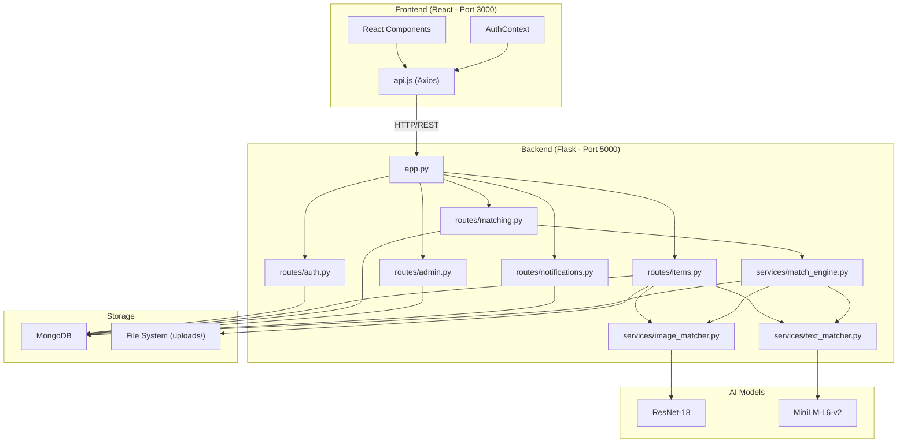
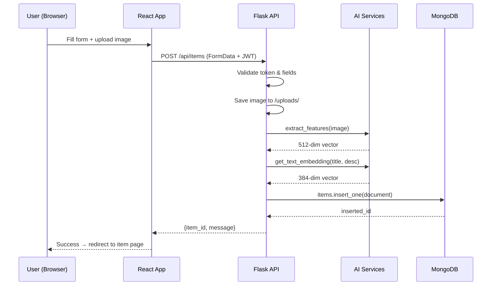
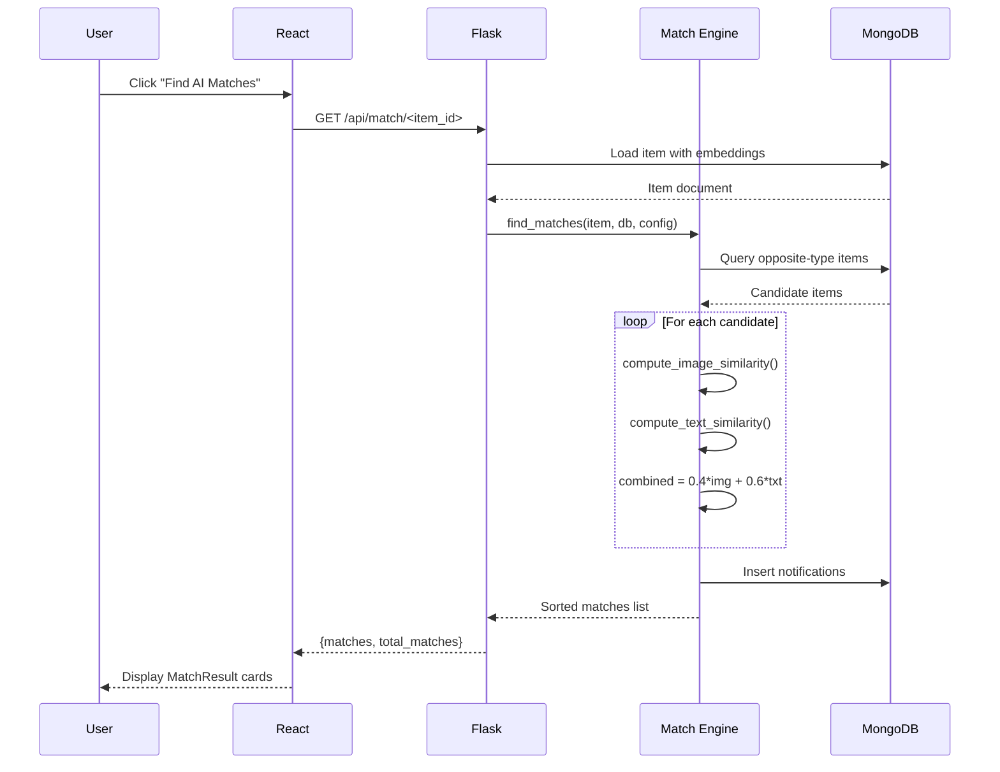
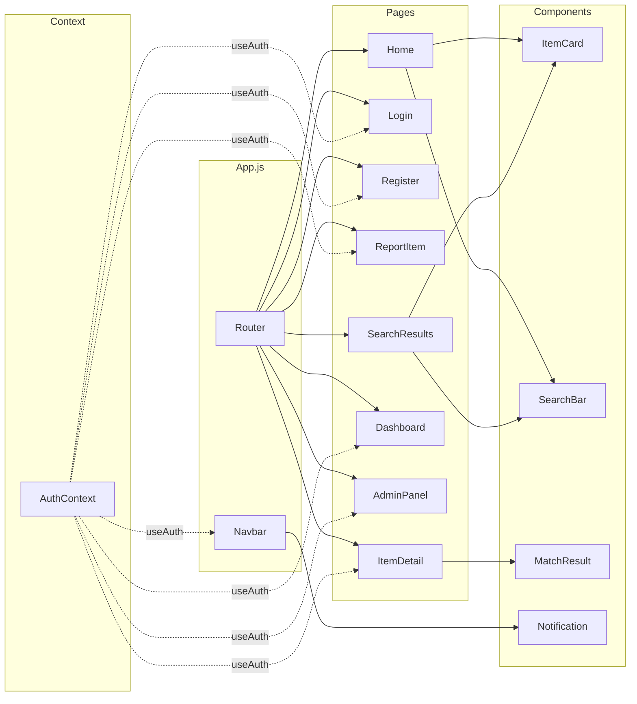

# E. Architecture Explanation

## System Architecture Overview



---

## Data Flow Diagram

### Reporting a Lost Item



### Finding Matches



---

## Request Lifecycle

Every API request follows this path:

```
1. Browser → HTTP Request
   ↓
2. Flask app.py receives request
   ↓
3. URL matching → routes to correct Blueprint
   ↓
4. Decorator chain:
   - @login_required → extracts JWT → validates → loads user from DB
   - @admin_required → checks user.role == "admin"
   ↓
5. Route handler function executes:
   - Reads request data (JSON body, form data, query params)
   - Business logic (validation, computation)
   - Database operations (read/write via PyMongo)
   ↓
6. Returns JSON response with status code
   ↓
7. Flask → HTTP Response → Browser
   ↓
8. Axios resolves promise → React updates state → UI re-renders
```

---

## Component Interaction Map



---

## Database Schema

### Collection: `users`
```json
{
  "_id": "ObjectId",
  "name": "string",
  "email": "string (unique)",
  "password": "binary (bcrypt hash)",
  "role": "string ('user' | 'admin')",
  "created_at": "datetime"
}
```

### Collection: `items`
```json
{
  "_id": "ObjectId",
  "user_id": "string (references users._id)",
  "type": "string ('lost' | 'found')",
  "title": "string",
  "description": "string",
  "category": "string (from CATEGORIES list)",
  "location": "string",
  "date_reported": "string",
  "image_path": "string (filename in uploads/)",
  "image_features": "[float] (512 elements, ResNet vector)",
  "text_embedding": "[float] (384 elements, BERT vector)",
  "status": "string ('active' | 'resolved' | 'removed')",
  "created_at": "datetime"
}
```

### Collection: `notifications`
```json
{
  "_id": "ObjectId",
  "user_id": "string (references users._id)",
  "message": "string",
  "item_id": "string (references items._id)",
  "match_id": "string (references items._id)",
  "read": "boolean",
  "created_at": "datetime"
}
```

---

## Complete API Endpoints

### Authentication (`/api/auth`)

| Method | Endpoint | Auth | Request | Response |
|--------|----------|------|---------|----------|
| POST | `/register` | No | `{name, email, password}` | `{token, user}` 201 |
| POST | `/login` | No | `{email, password}` | `{token, user}` 200 |
| GET | `/me` | JWT | — | `{id, name, email, role}` 200 |

### Items (`/api/items`)

| Method | Endpoint | Auth | Request | Response |
|--------|----------|------|---------|----------|
| POST | `/` | JWT | FormData: type, title, description, category, location, date_reported, image | `{item_id, message}` 201 |
| GET | `/` | No | Query: type, category, location, search, page, per_page | `{items[], total, page, pages}` |
| GET | `/<id>` | No | — | `{item details}` |
| GET | `/my` | JWT | — | `{items[]}` |
| PUT | `/<id>` | JWT (owner) | `{title?, description?, category?, status?}` | `{message}` |
| DELETE | `/<id>` | JWT (owner) | — | `{message}` |
| GET | `/categories` | No | — | `{categories[]}` |

### Matching (`/api/match`)

| Method | Endpoint | Auth | Request | Response |
|--------|----------|------|---------|----------|
| GET | `/<item_id>` | JWT (owner) | — | `{item_id, matches[], total_matches}` |

### Admin (`/api/admin`)

| Method | Endpoint | Auth | Request | Response |
|--------|----------|------|---------|----------|
| GET | `/stats` | Admin | — | `{total_users, total_items, lost_items, found_items, active_items, resolved_items}` |
| GET | `/users` | Admin | — | `{users[]}` |
| GET | `/items` | Admin | — | `{items[]}` |
| PUT | `/items/<id>/status` | Admin | `{status}` | `{message}` |
| DELETE | `/users/<id>` | Admin | — | `{message}` |

### Notifications (`/api/notifications`)

| Method | Endpoint | Auth | Request | Response |
|--------|----------|------|---------|----------|
| GET | `/` | JWT | — | `{notifications[]}` |
| PUT | `/<id>/read` | JWT | — | `{message}` |
| GET | `/unread-count` | JWT | — | `{unread_count}` |

---

## AI Matching Algorithm

```
Input: Item X (lost or found)

1. Determine search_type = opposite of X.type
2. Query candidates from MongoDB:
   - Same category as X
   - status = "active"
   - Different user than X

3. For each candidate C:
   a. img_score = cosine_similarity(X.image_features, C.image_features)
   b. txt_score = cosine_similarity(X.text_embedding, C.text_embedding)
   c. If both have images:
        combined = 0.4 × img_score + 0.6 × txt_score
      Else:
        combined = txt_score
   d. If combined >= 0.5:
        Add to matches list

4. Sort matches by combined score (descending)
5. Return top 10 matches
6. Create notifications for item owner and top-3 match owners
```
